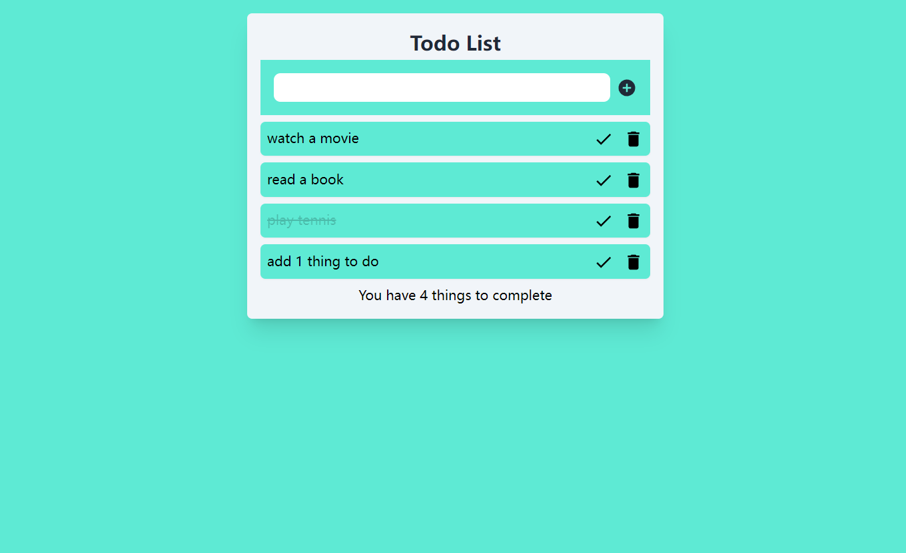
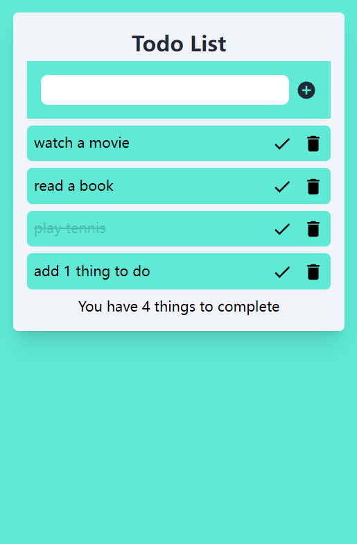

# TODO List APP

This app is built with Typescript, Tailwind, React and Firebase. Users can add a task in the Todo List, and mark a task as done or delete the task. Data is stored in Firebase Cloud Firestore.

## Screenshots
The pc view:


The mobile view:


## How to run the code
1. Begin by cloning this repository.

    ```https://github.com/Zhengxing-Gu/Todo-List-APP.git```

2. Once cloned successfully, navigate over to the root of the directory and type 
in the following command to install the packages needed for the project: 

    ```npm install```

3. After installing the packages, you can use the following command to run the project. 

    ```npm run dev```